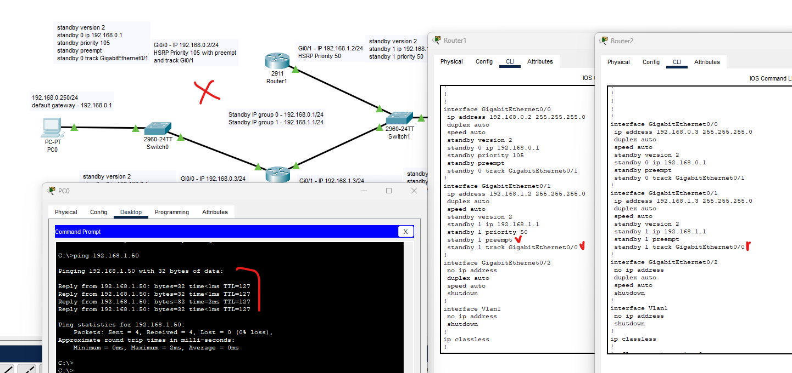
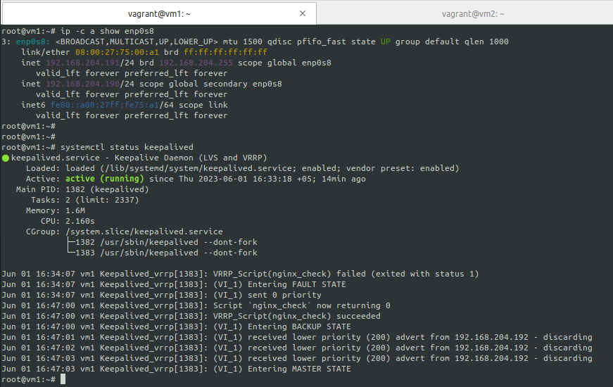
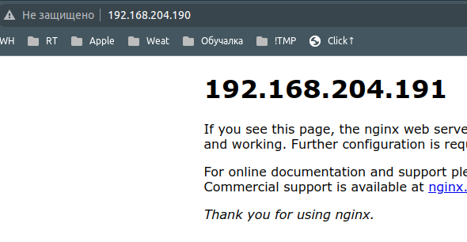
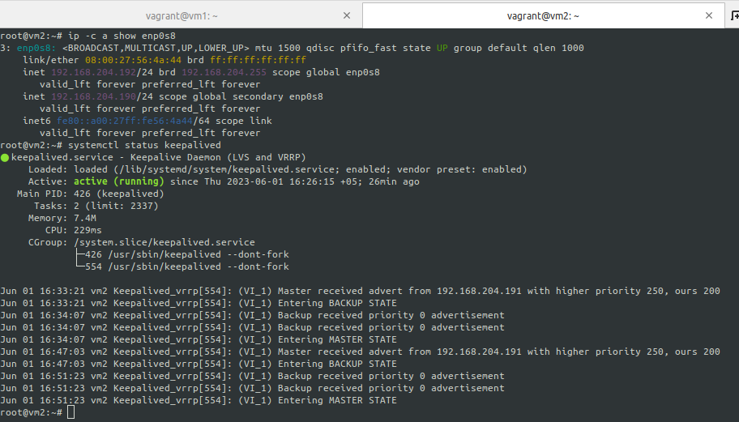
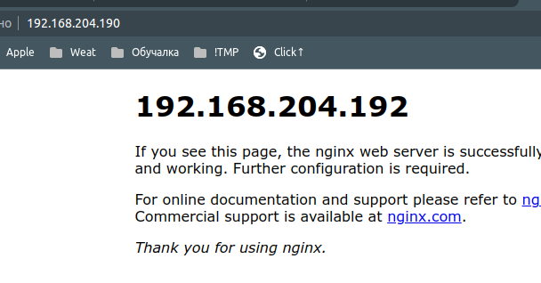

# Disaster recovery и Keepalived - Лебедев Д.С.

### Задание 1
> - Дана [схема](_attachments/hsrp_advanced.pkt) для Cisco Packet Tracer, рассматриваемая в лекции.
> - На данной схеме уже настроено отслеживание интерфейсов маршрутизаторов Gi0/1 (для нулевой группы)
> - Необходимо аналогично настроить отслеживание состояния интерфейсов Gi0/0 (для первой группы).
> - Для проверки корректности настройки, разорвите один из кабелей между одним из маршрутизаторов и Switch0 и запустите ping между PC0 и Server0.
> - На проверку отправьте получившуюся схему в формате pkt и скриншот, где виден процесс настройки маршрутизатора.

*Ответ:*  
- На первом роутере на интерфейсе GE0/1 добавлен `standby 1 track GigabitEthernet0/0`, назначен `preempt`
- На втором роутере на интерфейсе GE0/1 добавлен `standby 1 track GigabitEthernet0/0`  
```sh
# Router 1
en
conf t
interface GigabitEthernet0/1
standby 1 preempt
standby 1 track GigabitEthernet0/0

# Router 2
en
conf t
interface GigabitEthernet0/1
standby 1 track GigabitEthernet0/0

**
show running-config
```

[Схема с изменениями](_attachments/10.01-1_hsrp_advanced.pkt)



### Задание 2
> - Запустите две виртуальные машины Linux, установите и настройте сервис Keepalived как в лекции, используя пример конфигурационного [файла](https://github.com/netology-code/sflt-homeworks/blob/main/1/keepalived-simple.conf).
> - Настройте любой веб-сервер (например, nginx или simple python server) на двух виртуальных машинах
> - Напишите Bash-скрипт, который будет проверять доступность порта данного веб-сервера и существование файла index.html в root-директории данного веб-сервера.
> - Настройте Keepalived так, чтобы он запускал данный скрипт каждые 3 секунды и переносил виртуальный IP на другой сервер, если bash-скрипт завершался с кодом, отличным от нуля (то есть порт веб-сервера был недоступен или отсутствовал index.html). Используйте для этого секцию vrrp_script
> - На проверку отправьте получившейся bash-скрипт и конфигурационный файл keepalived, а также скриншот с демонстрацией переезда плавающего ip на другой сервер в случае недоступности порта или файла index.html

*Ответ:*  
Скрипт `ng_check.sh` проверяет 80 порт и наличие дефолтного индексного файла файла:  
```sh
#!/bin/bash
nc -z localhost 80 && test -f /var/www/html/index.nginx-debian.html
```

Методом проб выяснили, что на ноде мастера не должно быть приоритета 255, иначе скрипт не работает.  
```sh
global_defs {
  enable_script_security
}

vrrp_script nginx_check {
# script "/usr/bin/curl http://127.0.0.1"
  script "/usr/local/bin/ng_check.sh"
  interval 3
  user root
}
vrrp_instance VI_1 {
  state MASTER
  interface enp0s8
  virtual_router_id 190
  priority 250
  advert_int 1
  virtual_ipaddress {
    192.168.204.190/24
  }
  track_script {
    nginx_check
  }
}
```

Нормальное состояние:  


  

Удаляем индексный файл, скриншоты ноды BACKUP:  
  


