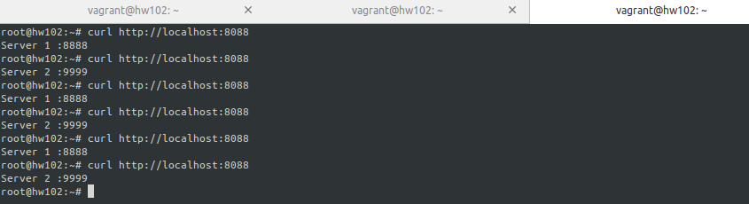
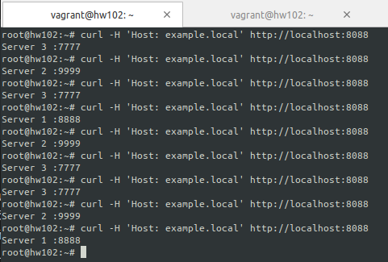
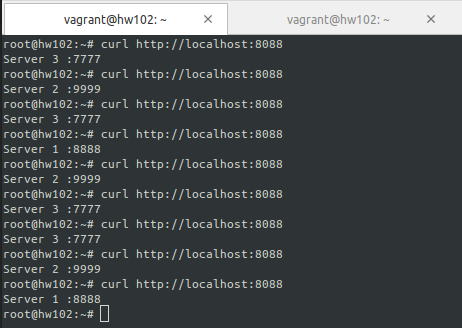
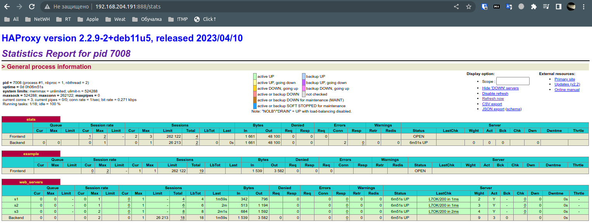

# 10.02. Кластеризация и балансировка нагрузки - Лебедев Д.С.

### Задание 1
> - Запустите два simple python сервера на своей виртуальной машине на разных портах
> - Установите и настройте HAProxy, воспользуйтесь материалами к лекции по [ссылке](https://github.com/netology-code/sflt-homeworks/tree/main/2)
> - Настройте балансировку Round-robin на 4 уровне.
> - На проверку направьте конфигурационный файл haproxy, скриншоты, где видно перенаправление запросов на разные серверы при обращении к HAProxy.

*Ответ:*  
Листинг части конфигурационного файла  
```sh
listen stats  # веб-страница со статистикой
        bind                    :888
        mode                    http
        stats                   enable
        stats uri               /stats
        stats refresh           5s
        stats realm             Haproxy\ Statistics

frontend example  # секция фронтенд
        mode http
        bind :8088
        default_backend web_servers

backend web_servers    # секция бэкенд
        mode http
        balance roundrobin
        option httpchk
        http-check send meth GET uri /index.html
        server s1 127.0.0.1:8888 check
        server s2 127.0.0.1:9999 check
```

Пример работы балансировки на 4 уровне  


### Задание 2
> - Запустите три simple python сервера на своей виртуальной машине на разных портах
> - Настройте балансировку Weighted Round Robin на 7 уровне, чтобы первый сервер имел вес 2, второй - 3, а третий - 4
> - HAproxy должен балансировать только тот http-трафик, который адресован домену example.local
> - На проверку направьте конфигурационный файл haproxy, скриншоты, где видно перенаправление запросов на разные серверы при обращении к HAProxy c использованием домена example.local и без него.

*Ответ:*  
Листинг части конфигурационного файла  
```sh
frontend example  # секция фронтенд
        mode http
        bind :8088
        default_backend web_servers
        acl ACL_example.local hdr(host) -i example.local
        use_backend web_servers if ACL_example.local

backend web_servers    # секция бэкенд
        mode http
        balance roundrobin
        option httpchk
        http-check send meth GET uri /index.html
        server s1 127.0.0.1:8888 weight 2 check
        server s2 127.0.0.1:9999 weight 3 check
        server s3 127.0.0.1:7777 weight 4 check
```

Обращение к серверу с использованием домена. Из 9-ти запросов - 4 на третий сервер, 3 - на второй сервер и 2 на первый:  
  

Обращение без домена:  
  

Страница статистики:  
