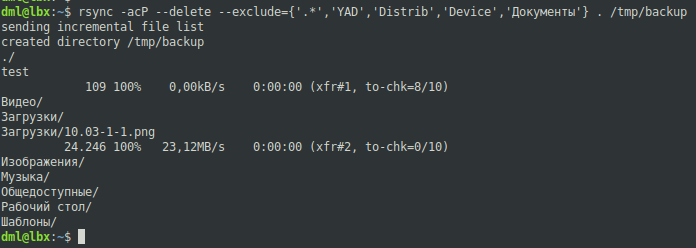
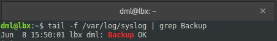

# 10.03. Резервное копирование - Лебедев Д.С.

### Задание 1
> - Составьте команду rsync, которая позволяет создавать зеркальную копию домашней директории пользователя в директорию `/tmp/backup`
> - Необходимо исключить из синхронизации все директории, начинающиеся с точки (скрытые)
> - Необходимо сделать так, чтобы rsync подсчитывал хэш-суммы для всех файлов, даже если их время модификации и размер идентичны в источнике и приемнике.
> - На проверку направить скриншот с командой и результатом ее выполнения

*Ответ:*  
Используется следующая команда:  
```sh
rsync -acP --delete --exclude={'.*','YAD','Distrib','Device','Документы'} . /tmp/backup
```

где:
Из синхронизации исключены скрытые файлы и директории, а так же некоторые (большие) каталоги.
Флаги: 
- a - (archive) - включение сжатия данных;
- c - (checksum) - для сравнения файлов по контрольной сумме, вместо даты/времени изменения или размера;
- P - эквивалентна `--partial --progress`, которая оставляет частично переданные файлы и показывает шкалу прогресса во время передачи;
- --delete - выполняет требование "зеркальности" копии. Файлы, удалённые в источнике, должны быть удалены и из резервной копии.



### Задание 2
> - Написать скрипт и настроить задачу на регулярное резервное копирование домашней директории пользователя с помощью rsync и cron.
> - Резервная копия должна быть полностью зеркальной
> - Резервная копия должна создаваться раз в день, в системном логе должна появляться запись об успешном или неуспешном выполнении операции
> - Резервная копия размещается локально, в директории `/tmp/backup`
> - На проверку направить файл crontab и скриншот с результатом работы утилиты.

*Ответ:*  
Листинг настройки (выполнение ежедневно в 15:50) `cron`:  
```sh
50 15 * * * /usr/local/bin/backup.sh
```

Листинг скрипта `backup.sh`:  
```sh
#!/bin/bash
rsync -acP --delete --exclude={'.*','YAD','Distrib','Device','Документы'} . /tmp/backup
if
[ $? -eq 0 ]; then
logger "Backup OK"
else
logger "Backup failed"
fi
```

Команды просмотра лога:
```sh
journalctl -xe | grep Backup
tail -f /var/log/syslog | grep Backup
```

Результат работы скрипта  
