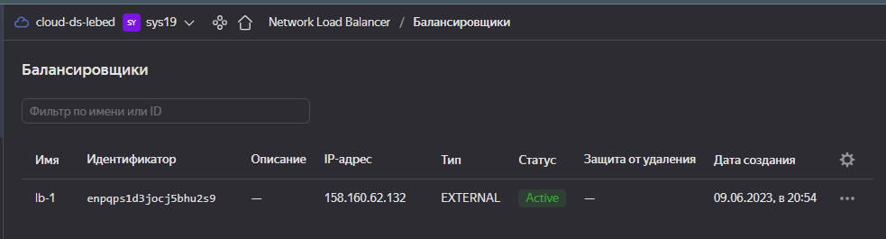
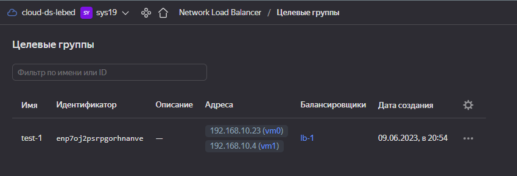
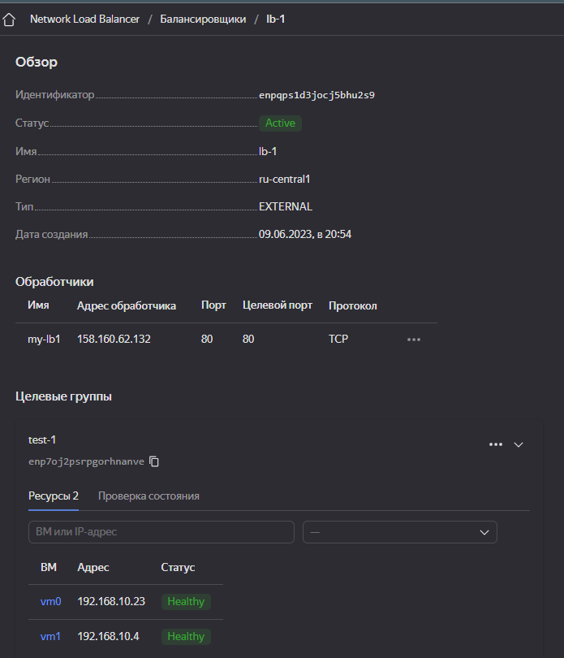
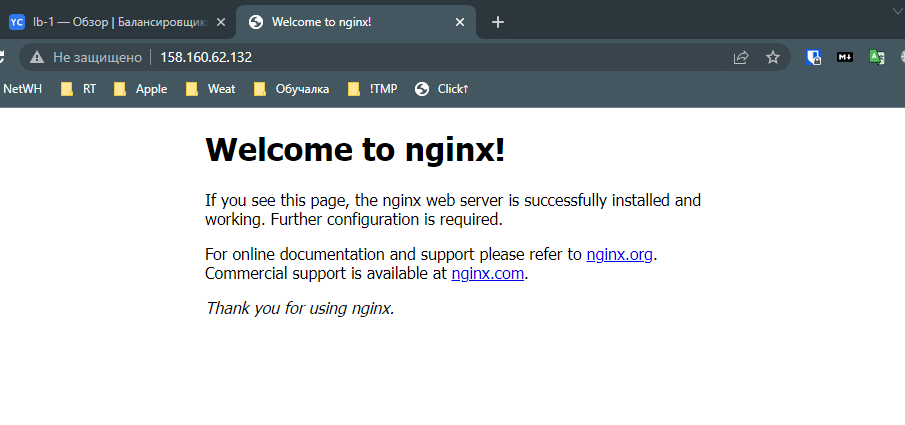
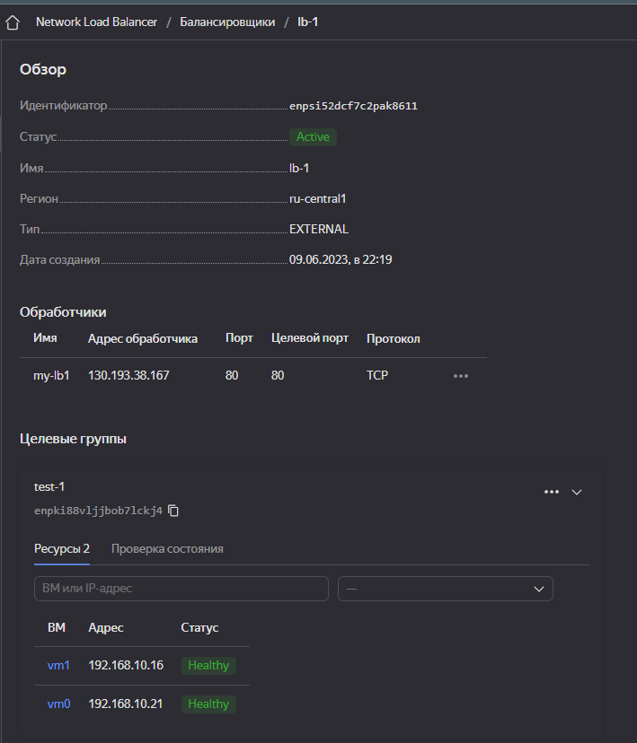
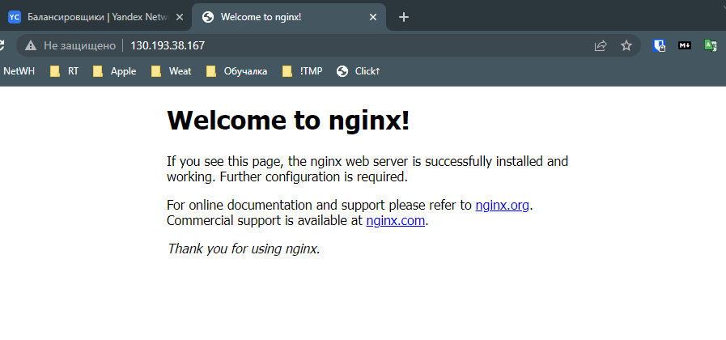

# 10.04. Отказоустойчивость в облаке - Лебедев Д.С.

### Задание 1
> Возьмите за основу решение к заданию 1 из занятия ''[Подъём инфраструктуры в Яндекс Облаке](../../05.CICD-19/HW-CICD/07.03.CICD-19.HW.md)"
> 1. Теперь вместо одной виртуальной машины сделайте terraform playbook, который:
> - создаст 2 идентичные виртуальные машины. Используйте аргумент count для создания таких ресурсов;
> - создаст таргет-группу. Поместите в неё созданные на шаге 1 виртуальные машины;
> - создаст сетевой балансировщик нагрузки, который слушает на порту 80, отправляет трафик на порт 80 виртуальных машин и http healthcheck на порт 80 виртуальных машин.
> Рекомендуем изучить документацию сетевого балансировщика нагрузки для того, чтобы было понятно, что вы сделали.
> 2. Установите на созданные виртуальные машины пакет Nginx любым удобным способом и запустите Nginx веб-сервер на порту 80.
> 3. Перейдите в веб-консоль Yandex Cloud и убедитесь, что:
> - созданный балансировщик находится в статусе Active,
> - обе виртуальные машины в целевой группе находятся в состоянии healthy.
> 4. Сделайте запрос на 80 порт на внешний IP-адрес балансировщика и убедитесь, что вы получаете ответ в виде дефолтной страницы Nginx.
> 
> *В качестве результата пришлите:
> 1. Terraform Playbook.
> 2. Скриншот статуса балансировщика и целевой группы.
> 3. Скриншот страницы, которая открылась при запросе IP-адреса балансировщика.*

*Ответ:*  

Terraform Playbook:  
```sh
terraform {
  required_providers {
    yandex = {
      source = "yandex-cloud/yandex"
    }
  }
}

# Описание провайдера
provider "yandex" {
token = "xxx"
  cloud_id = "xxx"
  folder_id = "xxx"
  zone = "ru-central1-a"
}

# Определяем виртуальные машины
resource "yandex_compute_instance" "vm" {
  count = 2
  name = "vm${count.index}"
  boot_disk {
    initialize_params {
      image_id = "fd86hk78p8c8pak9vdlr"
      size = 5
    }
  }

# Сеть
  network_interface {
    subnet_id = yandex_vpc_subnet.subnet-1.id
    nat       = true
  }

# Описание ресурсов ВМ
  resources {
     core_fraction = 20
     cores  = 2
     memory = 2
  }

# Подключаем файл для авторизации
  metadata = {
    user-data = "${file("./meta.yaml")}"
  }

}

resource "yandex_vpc_network" "network-1" {
  name = "network1"
}

resource "yandex_vpc_subnet" "subnet-1" {
  name           = "subnet1"
  zone           = "ru-central1-a"
  v4_cidr_blocks = ["192.168.10.0/24"]
  network_id     = "${yandex_vpc_network.network-1.id}"
}

# Целевая группа для балансировщика
resource "yandex_lb_target_group" "test-1" {
  name      = "test-1"
  target {
    subnet_id = yandex_vpc_subnet.subnet-1.id
    address   = yandex_compute_instance.vm[0].network_interface.0.ip_address
  }
  target {
    subnet_id = yandex_vpc_subnet.subnet-1.id
    address   = yandex_compute_instance.vm[1].network_interface.0.ip_address
  }
}

# Балансировщик нагрузки (сетевой)
resource "yandex_lb_network_load_balancer" "lb-1" {
  name = "lb-1"
  listener {
    name = "my-lb1"
    port = 80
    external_address_spec {
      ip_version = "ipv4"
    }
  }
  attached_target_group {
    target_group_id = yandex_lb_target_group.test-1.id
    healthcheck {
      name = "http"
      http_options {
        port = 80
        path = "/"
      }
    }
  }
}

# Вывести IP виртушек для подключения
output "external_ip_address_vm_0" {
  value = yandex_compute_instance.vm[0].network_interface.0.nat_ip_address
}

output "external_ip_address_vm_1" {
  value = yandex_compute_instance.vm[1].network_interface.0.nat_ip_address
}

```

meta.yaml:  
```sh
#cloud-config
users:
  - name: dml
    groups: sudo
    shell: /bin/bash
    sudo: ['ALL=(ALL) NOPASSWD:ALL']
    ssh_authorized_keys:
      - ssh-rsa AAAAB3Nza...
```

Статус балансировщика и целевой группы  
  

  

  

Ответ nginx по адресу балансировщика:  


### Задание 2*
> 1. Теперь вместо создания виртуальных машин создайте группу виртуальных машин с балансировщиком нагрузки.
> 2. Nginx нужно будет поставить тоже автоматизированно. Для этого вам нужно будет подложить файл установки Nginx в user-data-ключ метадаты виртуальной машины.
> - Пример файла установки Nginx.
> - Как подставлять файл в метадату виртуальной машины.
> 3. Перейдите в веб-консоль Yandex Cloud и убедитесь, что:
> - созданный балансировщик находится в статусе Active,
> - обе виртуальные машины в целевой группе находятся в состоянии healthy.
> 4. Сделайте запрос на 80 порт на внешний IP-адрес балансировщика и убедитесь, что вы получаете ответ в виде дефолтной страницы Nginx.
> 
> *В качестве результата пришлите
> 1. Terraform Playbook.
> 2. Скриншот статуса балансировщика и целевой группы.
> 3. Скриншот страницы, которая открылась при запросе IP-адреса балансировщика.*

*Ответ:*  
Terraform Playbook:  
```sh
# Описание провайдера
provider "yandex" {
token = "xxx"
  cloud_id = "xxx"
  folder_id = "xxx"
  zone = "ru-central1-a"
}

# Определяем виртуальные машины
resource "yandex_compute_instance" "vm" {
  count = 2
  name = "vm${count.index}"
  boot_disk {
    initialize_params {
      image_id = "fd86hk78p8c8pak9vdlr"
      size = 5
    }
  }

# Сеть
  network_interface {
    subnet_id = yandex_vpc_subnet.subnet-1.id
    nat       = true
  }

# Описание ресурсов ВМ
  resources {
     core_fraction = 20
     cores  = 2
     memory = 2
  }

  metadata = {
    user-data = "${file("./meta.yaml")}"
  }
}

# Описание группы размещения
resource "yandex_compute_placement_group" "group1" {
  name = "test-pg1"
}

resource "yandex_vpc_network" "network-1" {
  name = "network1"
}

resource "yandex_vpc_subnet" "subnet-1" {
  name           = "subnet1"
  zone           = "ru-central1-a"
  v4_cidr_blocks = ["192.168.10.0/24"]
  network_id     = "${yandex_vpc_network.network-1.id}"
}

# Целевая группа для балансировщика
resource "yandex_lb_target_group" "test-1" {
  name      = "test-1"
  target {
    subnet_id = yandex_vpc_subnet.subnet-1.id
    address   = yandex_compute_instance.vm[0].network_interface.0.ip_address
  }
  target {
    subnet_id = yandex_vpc_subnet.subnet-1.id
    address   = yandex_compute_instance.vm[1].network_interface.0.ip_address
  }
}

# Балансировщик нагрузки (сетевой)
resource "yandex_lb_network_load_balancer" "lb-1" {
  name = "lb-1"
  listener {
    name = "my-lb1"
    port = 80
    external_address_spec {
      ip_version = "ipv4"
    }
  }
  attached_target_group {
    target_group_id = yandex_lb_target_group.test-1.id
    healthcheck {
      name = "http"
      http_options {
        port = 80
        path = "/"
      }
    }
  }
}
```

meta.yaml:  
```sh
#cloud-config
disable_root: true
timezone: Europe/Moscow
repo_update: true
repo_upgrade: true
apt:
  preserve_sources_list: true
packages:
  - nginx
runcmd:
  - [ systemctl, nginx-reload ]
  - [ systemctl, enable, nginx.service ]
  - [ systemctl, start, --no-block, nginx.service ]
users:
  - name: dml
    groups: sudo
    shell: /bin/bash
    sudo: ['ALL=(ALL) NOPASSWD:ALL']
    ssh_authorized_keys:
      - ssh-rsa AAAAB3Nza...
```

Cтатус балансировщика и целевой группы:  
  

Ответ nginx по адресу балансировщика:  
